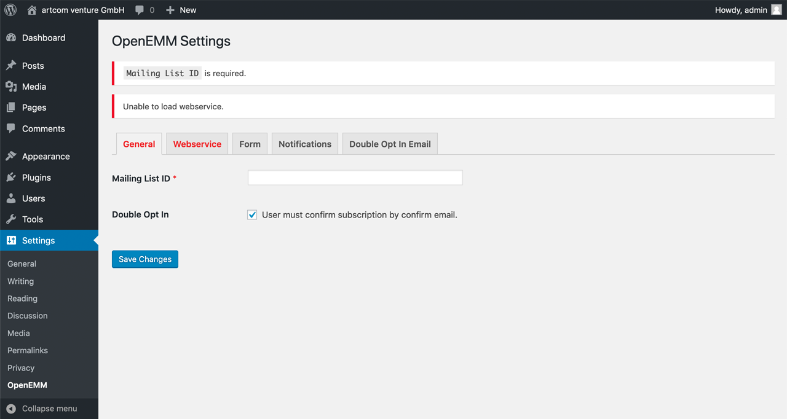

# OpenEMM Newsletter subscription

## Installation

1. Upload files to the `/wp-content/plugins/` directory of your WordPress installation.
  * Either [download the latest files](https://github.com/artcomventure/wordpress-plugin-OpenEMM/archive/master.zip) and extract zip (optionally rename folder)
  * ... or clone repository:
  ```
  $ cd /PATH/TO/WORDPRESS/wp-content/plugins/
  $ git clone https://github.com/artcomventure/wordpress-plugin-OpenEMM.git
  ```
  If you want a different folder name than `wordpress-plugin-OpenEMM` extend clone command by ` 'FOLDERNAME'` (replace the word `'FOLDERNAME'` by your chosen one):
  ```
  $ git clone https://github.com/artcomventure/wordpress-plugin-OpenEMM.git 'FOLDERNAME'
  ```
2. Activate the plugin through the 'Plugins' screen in WordPress.
3. **Enjoy**

## Usage

Once activated you'll find the 'OPENEMM' settings page listed in the submenu of 'Settings'.



1. Enter required values for mailing list ID and path to webservice's file and its credentials.
2. Choose optional/required fields for your subscription form.
3. Customize the notifications.
4. Customize the douple opt in (optional) email.

To display the subscription form insert the shortcode `[openemm] into the editor``

## Plugin Updates

Although the plugin is not _yet_ listed on https://wordpress.org/plugins/, you can use WordPress' update functionality to keep it in sync with the files from [GitHub](https://github.com/artcomventure/wordpress-plugin-slider).

**Please use for this our [WordPress Repository Updater](https://github.com/artcomventure/wordpress-plugin-repoUpdater)** with the settings:

* Repository URL: https://github.com/artcomventure/wordpress-plugin-OpenEMM/
* Subfolder (optionally, if you don't want/need the development files in your environment): build

_We test our plugin through its paces, but we advise you to take all safety precautions before the update. Just in case of the unexpected._

## Questions, concerns, needs, suggestions?

Don't hesitate! [Issues](https://github.com/artcomventure/wordpress-plugin-OpenEMM/issues) welcome.